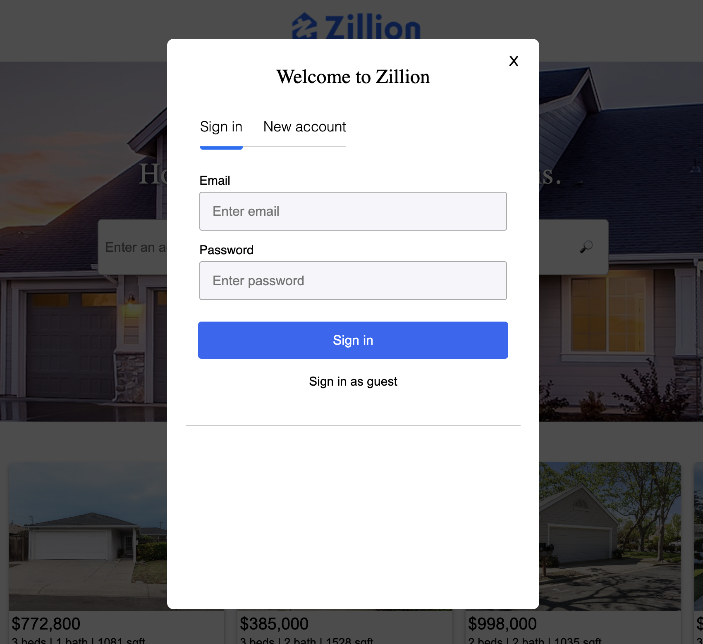
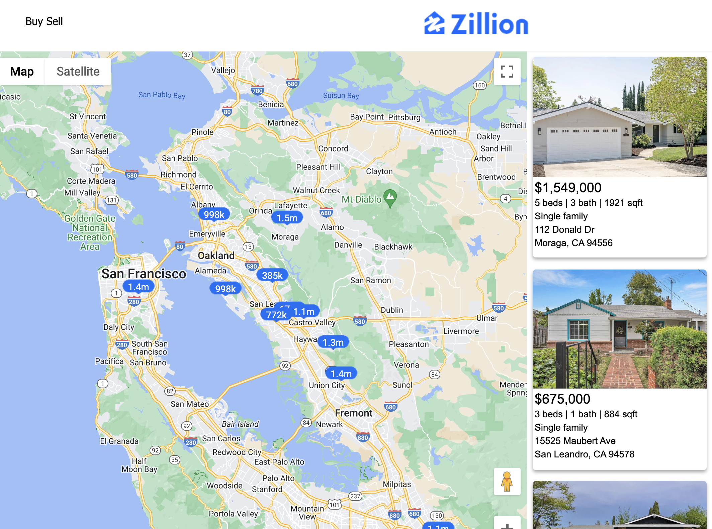
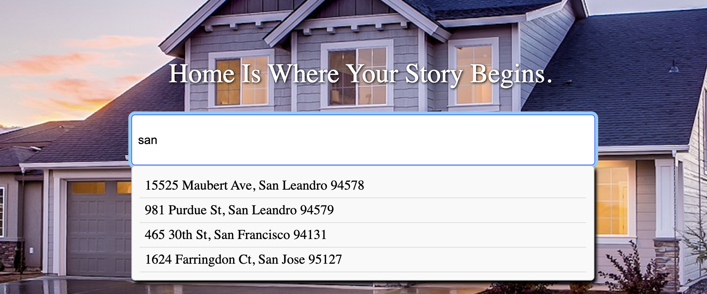

Zillion is a clone of Zillow, a real estate website.

## Technologies
This project was made using:
Frontend: React, Redux, JavaScript, CSS, and Google Maps JavaScript API
Backend: PostgreSQL, Rails, Ruby, and AWS
Features
### User Authentication
Zillion uses a combination of frontend and server-side validations to provide the user with a smooth and secure experience.

### Listing Map
Listings can be easily located on the embedded Google map on the "Buy" page with markers of the price. When the listing map component is mounted, click listeners are applied to all of the listing markers that links to the listing when clicked.

### Listing Search
Users can search listings by address, city, or zip code. The search results appears in a drop down menu that allows the user to select the link to the listing.
